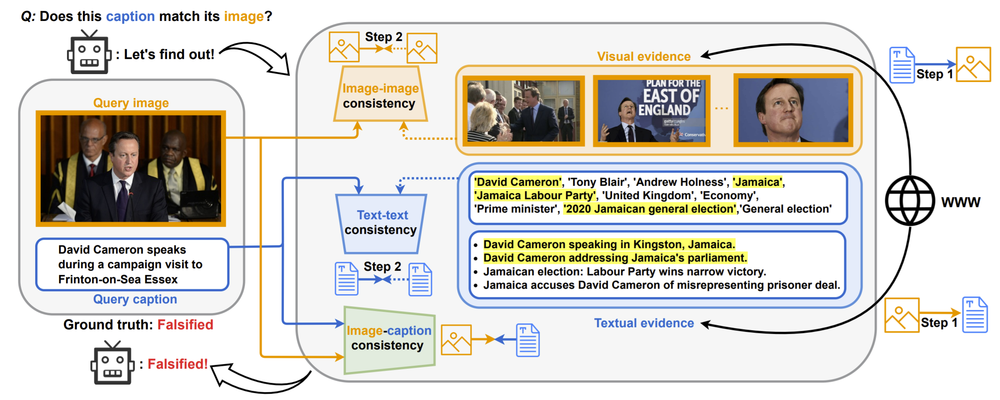

{:refdef: style="text-align: center;"}
{:width="150%"}
{: refdef}

### Abstract
Misinformation is now a major problem due to its potential high risks to our core democratic and societal values and orders. Out-of-context misinformation is one of the easiest and effective ways used by adversaries to spread viral false stories. In this threat, a real image is re-purposed to support other narratives by misrepresenting its context and/or elements. The internet is being used as the go-to way to verify information using different sources and modalities. Our goal is an inspectable method that automates this time-consuming and reasoning-intensive process by fact-checking the image-caption pairing using Web evidence. To integrate evidence and cues from both modalities, we introduce the concept of 'multi-modal cycle-consistency check'; starting from the image/caption, we gather textual/visual evidence, which will be compared against the other paired caption/image, respectively. Moreover, we propose a novel architecture, Consistency-Checking Network (CCN), that mimics the layered human reasoning across the same and different modalities: the caption vs. textual evidence, the image vs. visual evidence, and the image vs. caption. Our work offers the first step and benchmark for open-domain, content-based, multi-modal fact-checking, and significantly outperforms previous baselines that did not leverage external evidence.

### Dataset

